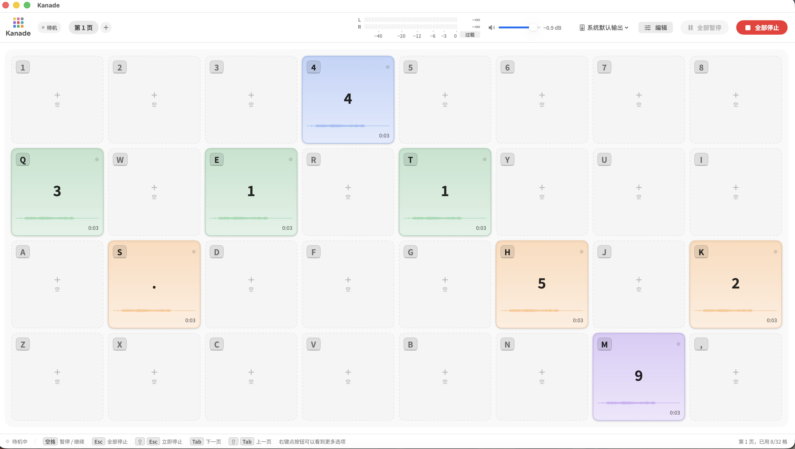
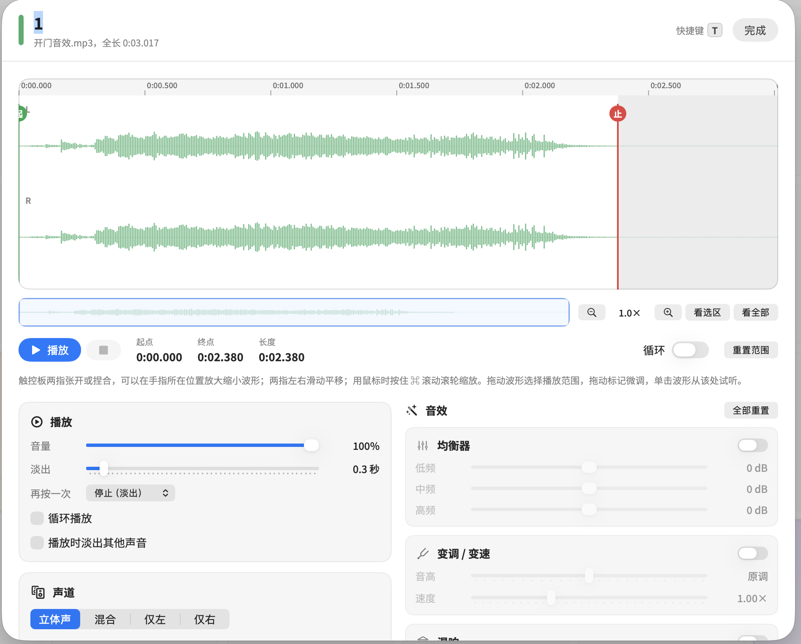

# Kanade（奏）

一款用于广播、演出和活动现场的 macOS 音效播放软件（播放墙）。
把音频拖进格子，按下对应的键盘按键即可立即播放。

当前版本：**3.2**

受经典的 Mac 播控软件 Ambrosia Soundboard 启发，全部代码为重新编写。

> 本项目与 Ambrosia Software 没有任何关联，也未获得其授权或认可。

## 开发说明与免责声明

- **本项目的代码由 Anthropic 的 AI 模型 Claude（Claude Opus 5.5）编写**，作者负责提出需求、测试和反馈。
- **作者不是专业的 macOS 开发者。** 本软件未经过系统性的测试和专业的代码审查，不保证可靠性、稳定性和兼容性。
- 在正式的直播、演出等不容出错的场合使用前，请先充分测试，并准备好备用的播放手段。
- 因使用本软件造成的任何问题或损失，作者不承担责任（详见 [MIT 许可](LICENSE) 中的免责条款）。

## 功能

- 每页 32 个格子，默认按键盘四排键位排列（1–8、Q–I、A–K、Z–逗号），页面数量不限
- 按下即播：音频预先载入内存
- **最多同时播放 24 个声音**。超过 24 个时，最早开始播放的声音会自动淡出（约 0.4 秒），为新的声音让出位置；暂停中的声音最后才会被挤掉
- 每个格子可设置：音量、淡出时长、循环、独占（播放时淡出其他声音）、再按一次时的行为（停止 / 暂停继续 / 从头重播 / 叠加）
- 波形编辑：剪辑播放范围、设置循环范围（前奏加循环段），支持触控板捏合缩放到采样级
- 声道：立体声、左右混合、只用左声道或右声道，以及声像调节
- 音效：三段均衡、变调变速、混响、延迟
- 颜色、标签、自定义快捷键，右键菜单快速修改
- 总输出峰值电平表（dBFS），带峰值保持和过载指示
- MIDI 控制：用“MIDI 学习”把打击垫、键盘或控制器按钮绑定到格子和常用操作，Kanade 在后台时也能触发
- 备份与导入：把全部页面或单独一页连同音频导出成一个 zip 文件，方便换电脑、演出前备份或分享给同事




## 系统要求

- macOS 13 Ventura 或更新版本
- Apple 芯片（M1 及之后的 M 系列）的 Mac

Releases 页面提供的下载版只支持 Apple 芯片。本项目只在 Apple 芯片的 Mac 上开发和测试；
Intel Mac 的用户可以尝试自己编译，但不保证能正常工作。

## 安装

有两种方式，任选一种。

### 方式一：下载编译好的版本（推荐）

1. 打开本仓库的 **Releases** 页面，下载最新的 `Kanade-版本号-macOS.zip`。
2. 双击解压，得到 `Kanade.app`。
3. 把 `Kanade.app` 拖进“应用程序”文件夹。

#### 第一次打开时

本软件没有经过苹果公证（公证需要付费加入 Apple 开发者计划），所以第一次打开时 macOS 会拦截，这是正常现象：

1. 双击 `Kanade.app`，系统提示“无法打开”或“无法验证开发者”时，点“完成”或“取消”。
2. 打开“系统设置 → 隐私与安全性”，往下滚动到“安全性”一栏，会看到关于 Kanade 的提示，点 **“仍要打开”**，输入密码确认。
3. 之后就可以正常双击打开了，这个步骤只需要做一次。

在 macOS 14 及更早版本上，也可以在访达里**右键**点 `Kanade.app`，选“打开”，再在弹出的窗口里点“打开”。

如果系统提示 **“Kanade 已损坏，无法打开”**，并不是文件真的坏了，而是下载的文件被系统加上了隔离标记。在终端运行下面这行命令即可解除：

```bash
xattr -dr com.apple.quarantine /Applications/Kanade.app
```

### 方式二：自己编译

需要安装 Apple 命令行工具（不需要完整的 Xcode）。

```bash
# 第一次使用先安装命令行工具（已安装可跳过）
xcode-select --install

# 在项目文件夹里运行
bash build.sh
```

完成后文件夹里会生成 `Kanade.app`，把它拖进“应用程序”文件夹即可。自己编译的 app 不会被系统拦截。

- 如果你要修改后自己发布，请把 `build.sh` 开头的 `BUNDLE_ID` 改成你自己的标识符（例如 `io.github.你的用户名.kanade`），以免和原版冲突。
- 第一次编译会自动下载所需字体（思源黑体约 25 MB，以及 logo 字体），需要联网；之后使用本地缓存。下载失败时会先使用系统字体完成编译。

## 升级

1. 退出 Kanade。
2. 用新版的 `Kanade.app` 替换“应用程序”文件夹里的旧版。

页面设置和导入的音频保存在单独的数据文件夹里，替换 app 不会丢失。

## 卸载

1. 退出 Kanade。
2. 把“应用程序”文件夹里的 `Kanade.app` 拖进废纸篓。
3. 如果要连同全部页面和导入的音频一起删除，在终端运行：

   ```bash
   rm -rf ~/Library/Application\ Support/Kanade
   ```

   这只会删除 Kanade 保存的音频副本，电脑上的原始音频文件不受影响。**删除后无法恢复**，需要的话请先备份这个文件夹。
4. （可选）删除窗口位置等系统记录：

   ```bash
   rm -f ~/Library/Preferences/io.github.accelhp.kanade.plist
   rm -rf ~/Library/Saved\ Application\ State/io.github.accelhp.kanade.savedState
   ```

   如果是自己编译、并修改过 `build.sh` 里的 `BUNDLE_ID`，把命令里的标识符换成你设置的那个。

Kanade 不会在系统里安装字体或其他文件，以上就是全部内容。

## 快捷键

| 按键 | 作用 |
| --- | --- |
| 格子对应的键 | 播放该格子 |
| 空格 | 暂停 / 继续全部（空格未分配给格子时） |
| Esc | 全部淡出停止 |
| Shift + Esc | 全部立即停止 |
| Tab / Shift + Tab | 下一页 / 上一页（也可以用 ] 和 [） |
| ⌘ E | 切换编辑模式 |

在波形编辑窗口里：触控板两指张开或捏合缩放，两指左右滑动平移；⌘= 放大，⌘- 缩小，⌘0 显示整段。

## MIDI 控制

插上 MIDI 设备（打击垫、MIDI 键盘、控制器等）即可使用，中途插拔会自动重新连接。

- **绑定格子**：右键点格子，选“MIDI 学习…”，然后在设备上按下一个键或按钮。也可以在编辑面板的“标记”里点“学习”。
- **绑定常用操作**：在菜单栏的 **MIDI** 菜单里，可以给“全部停止、全部暂停 / 继续、上一页、下一页”分配按键。
- 支持音符消息（打击垫、琴键）和控制器消息（CC 按钮）。同一页里一个 MIDI 按键只对应一个格子，不同页面可以重复使用，和键盘快捷键一样。
- 学习过程中按 Esc 可以取消。
- 和键盘快捷键不同，**MIDI 在 Kanade 不是当前窗口时也能触发**。

## 备份与导入

在菜单栏的 **文件** 菜单里：

- **导出全部页面…**：把所有页面、设置和用到的音频打包成一个 zip 文件。
- **导出当前页…**：只导出正在显示的这一页。编辑模式下，右侧面板的“本页”里也有这个按钮。
- **导入备份…**：选择导出的 zip 文件，里面的页面会作为**新页面添加**进来，不会覆盖或删除现有的页面。

导入时，备份里的全局 MIDI 设置只会补充你还没设置的项目，不会覆盖现有设置。

## 数据位置

页面设置和导入的音频副本保存在：

```
~/Library/Application Support/Kanade/
```

备份这个文件夹即可备份全部内容。原始音频文件不会被修改。

## 字体

本软件使用的字体均以 SIL Open Font License 1.1 发布，可以免费使用和随软件分发。
字体文件不包含在本仓库中，由 `build.sh` 在编译时从官方仓库下载，并连同各自的许可文本一起打包进 app
（位于 `Kanade.app/Contents/Resources/Fonts/`）。

- **界面文字**：[思源黑体（Source Han Sans）](https://github.com/adobe-fonts/source-han-sans)，由 Adobe 发布。
- **logo**：默认使用 [Sora](https://fonts.google.com/specimen/Sora)，来自 [Google Fonts](https://github.com/google/fonts)。

右键菜单、菜单栏、提示框和文件选择窗口由 macOS 系统绘制，使用系统字体。

### 更换 logo 字体

打开 `build.sh`，修改开头的 `LOGO_FONT`，然后重新编译。可选：

Quicksand、Nunito、Comfortaa、Zen Maru Gothic、Outfit、Urbanist、Sora、Lexend、Poppins、Montserrat、
Josefin Sans、Space Grotesk、DM Serif Display、Cormorant Garamond

把 `LOGO_FONT` 留空（`LOGO_FONT=""`）则 logo 使用思源黑体。

## 许可

本项目以 [MIT 许可](LICENSE) 发布。
